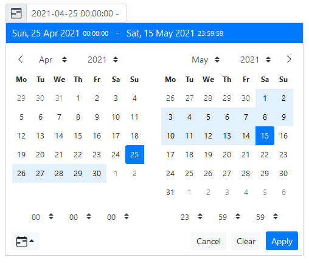

# Vue Datepicker Component





### Install with NPM
```
npm i @efournar/datepicker
```
### Demo
You have to clone the project and compile it in order to run.
```text
git clone https://github.com/e4nar/datetimepicker.git

npm run serve
```
### Include into your project
```js
import Datepicker from '@efournar/datepicker'
import '@efournar/datepicker/dist/datepicker.css'

Vue.use(Datepicker);
```

### Props
``` html
   <datepicker 
        v-model=""
        :is-range=""
        :display-icon=""
        :display-preview=""
        :display-time=""
        :disabled-dates=""
        :disabled-month-dates=""
        :disabled-week-days=""
        :min-date=""
        :max-date=""
   />
```

Prop | Type | Value |  Default
------------- | ------------- | ------------- | -------------
value (v-model) | String | A date or datetime string or a range, e.g. 2021-04-25 00:00:00 - 2021-05-15 23:59:59 | ''
isRange | Boolean | Enable this flag when in range | false
displayIcon | Boolean | Enable this flag in order to show icon in text field | true
displayPreview | Boolean | Shows preview of new selection before applying new value |  true
displayTime | Boolean | Enable this flag in case of datetime picker | false
disabledDates | Array | Disable specific dates. Array of date strings e.g. ['2021-04-25', '2021-03-05'] | []
disabledMonthDates | Array | Disable specific days for every month. Array of date strings e.g. ['02','15','27'] | []
disabledWeekDays | Array | Disable specific days for every week. Array of days, e.g. to disable Saturday and Sunday ['1','6'] | []
minDate | String | Disable dates lower than this date | ''
maxDate | String | Disable dates greater than this date | ''


### License
Datepicker is open-sourced software licensed under the [MIT license](http://opensource.org/licenses/MIT).